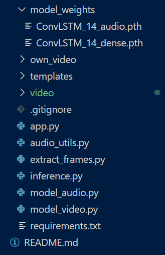

# 50.039-The-Theory-and-Practice-of-Deep-Learning-Y2021  

## Model creation
### Architecture 1:  
1. Obtain our version of  dataset, UCF_49 from [our dataset link](https://drive.google.com/file/d/18e6TwtREHLS2rLMXBKZx3MBm1JxjzUVF/view?usp=sharing) 
and the [our train_test_split](https://drive.google.com/file/d/1_uBpXEo4Kf2QJYw7D-YO_inn_e1Q-Cuv/view?usp=sharing).  
2. Git clone this entire github repository.
3. Unzip the *UCF_49* and *train_test_split* in the same folder where the repository is cloned.   In the terminal, run python extract_frames.py. Wait for about 2 hours to get all the frames.  
Alternatively, download and unzip the frames that [we have extracted](https://drive.google.com/file/d/1tjTB_TK53-UtP3l2o7pVMeNhVL_HA7Hz/view?usp=sharing). Make sure that the frames are in the same as the *train_test_split*.
4. Before running any model, make sure that you have *UCF_49-frames*, *train_test_split* and *visual_component.ipynb* in the same directory. Open the jupyter notebook, *visual_component.ipynb*, and run the codes accordingly for training and testing. 

### Architecture 2: 

1. Step 1-3 is the same as the Architecture 1.
2. Download the pickle file from [link](https://drive.google.com/file/d/12wsyIfR8-Ub2CBsOpTQ8-YY1__aKI-oM/view?usp=sharing).
3. Open the jupyter notebook and run the codes accordingly for training and testing. 

### Run User Interface (UI): 
1. Navigate into the *app* folder. Download  the [model weights](https://drive.google.com/file/d/1IfCCIiplXsHxU4x5_tUxLPbtH1-j2noD/view?usp=sharing) because the weights of the model are too large to be uploaded to github. Unzip and make sure that the *app* folder contains all of the files and folders as shown   .
2. Set-up for the UI locally.   
  a. Create a virtual environment using:   
    `python -m venv venv`  
  b. Activate the virtual environment:    
    - Activate the virtualenv (OS X & Linux)  
    `venv/bin/activate` 
    - Activate the virtualenv (Windows)  
    `venv\Scripts\activate`  
  c. Navigate out to the *app* folder. In the *app* folder, install the necessary libraries using   
    `pip install -r requirements.txt`

3. Run the application using:   
   `python app.py`
4. Choose a video clip with .avi format and upload, the result would be shown. The custom video used in the User Interface and Testing Results section can be found in the *own_video* folder.

